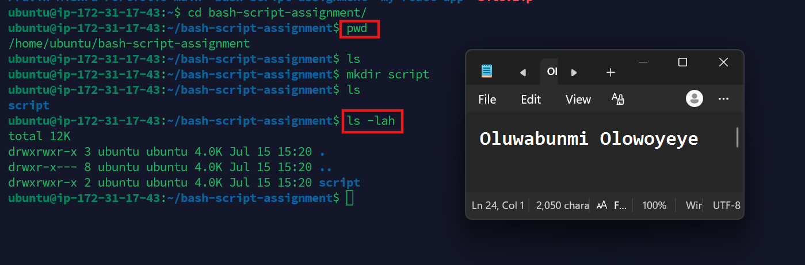

# Assignment 5 — Bash Script Automation Drill (OPS Checklist)

Part of the DevOps Micro Internship (DMI) Cohort 3 with Agentic AI

---

## Purpose

In this assignment, you will practice Bash scripting by building a series of small automation scripts covering environment setup, variables, arrays, loops, file conditionals, if-else logic, and functions. These scripts form the foundation of real-world Linux automation used in DevOps, cloud, and production support environments.

---

# Task 1 — Bash Environment & Workspace Setup

## Goal

Verify that Bash is available on your system and create a clean workspace for this assignment.

### Evidence

#### Screenshot 1 — Output of `echo $SHELL` and `bash --version`

---

#### Screenshot 2 — Output of `pwd` and `ls -lah` showing the scripts directory

---

### Notes

Answer the following in your own words:

**1. What is Bash?**

Bash (Bourne Again Shell) is a command-line interpreter and scripting language used mainly on Linux and Unix-based systems. It allows users to interact with the operating system by running commands, automating repetitive tasks, and writing scripts to manage files, applications, and system processes.

---

**2. What is the difference between shell and Bash?**

A shell is a general program that provides a command-line interface for interacting with an operating system. Bash is one specific type of shell. In other words, all Bash programs are shells, but not all shells are Bash. Other examples of shells include Zsh, Fish, and KornShell (ksh).

---

**3. Why is it important to confirm the Bash version before writing scripts?**

It is important to confirm the Bash version because different versions support different features and syntax. A script written for a newer version of Bash may not work correctly on an older version, leading to errors or unexpected behavior. Checking the version helps ensure compatibility and allows you to write scripts that will run reliably on the target system.

---

# Task 2 — Your First Bash Script

## Goal

Create your first Bash script, make it executable, and run it from the terminal.

### Evidence

#### Screenshot 1 — Content of `first-script.sh`

---

#### Screenshot 2 — Output of `./first-script.sh`

---

#### Screenshot 3 — Output of `ls -l first-script.sh` showing executable permission

---

### Notes

Answer the following in your own words:

**1. What is the purpose of `#!/bin/bash`?**

#!/bin/bash is called a shebang. It tells the operating system to use the Bash interpreter to execute the script, ensuring the commands in the script are run with Bash regardless of the user's default shell.

---

**2. Why do we use `chmod +x` before running a script?**

We use chmod +x to make a script executable. Without execute permission, the operating system will not allow the script to be run directly using ./first-script.sh.

---

**3. What is the difference between running a script using `./script.sh` and `bash script.sh`?**

./script.sh runs the script as an executable and requires the script to have execute permission (chmod +x). It also uses the interpreter specified in the shebang (such as #!/bin/bash).

bash script.sh explicitly tells Bash to run the script. It does not require the script to be executable, and Bash will interpret the script directly, regardless of whether a shebang is present.

---

# Task 3 — Variables: User Information Script

## Goal

Use variables to store and display user-related information.

### Evidence

#### Screenshot 1 — Content of `user-info.sh`

---

#### Screenshot 2 — Output of `./user-info.sh`

---

### Notes

Answer the following in your own words:

**1. What is a variable in Bash?**

A variable in Bash is a named container used to store a value, such as text, numbers, or command output. It allows you to reuse and manage data throughout a script without repeating the same information.

---

**2. Why should we avoid spaces around the `=` sign when creating variables?**

Bash requires variables to be assigned without spaces around the = sign. If spaces are added, Bash treats them as separate commands or arguments, which results in a syntax error or unexpected behavior.

---

**3. How do you access the value stored inside a Bash variable?**

You access the value of a Bash variable by placing a $ before the variable name. For example, if a variable is named name, you can access its value using $name.

---

# Task 4 — Arrays & Loops: Tools Checklist Script

## Goal

Use arrays and loops to print a checklist of tools used in Bash scripting.

### Evidence

#### Screenshot 1 — Content of `tools-checklist.sh`

---

#### Screenshot 2 — Output of `./tools-checklist.sh`

---

### Notes

Answer the following in your own words:

**1. What is an array in Bash?**

An array in Bash is a variable that can store multiple values under a single name. Each value is stored at a different index, making it easy to organize and access related data.

---

**2. Why are arrays useful in scripts?**

Arrays are useful because they allow you to store and manage multiple related values together. This makes scripts more organized and makes it easier to process lists of items without creating many separate variables.

---

**3. What does `"${tools[@]}"` mean?**

"${tools[@]}" refers to all the elements stored in the tools array. It expands each array element individually, making it useful for looping through or processing every item in the array.

---

**4. What is the purpose of the `for` loop in this script?**

The for loop is used to repeat a block of code for each item in the array. It processes each element one at a time, allowing the script to perform the same action on every value without writing repetitive code.

---

# Task 5 — Loops: Number Counter Script

## Goal

Use loops to repeat a task multiple times.

### Evidence

#### Screenshot 1 — Content of `counter.sh`

---

#### Screenshot 2 — Output of `./counter.sh`

---

### Notes

Answer the following in your own words:

**1. What is a loop?**

A loop is a programming structure that repeatedly executes a block of code until a condition is met or until it has processed all the items in a list.

---

**2. Why do we use loops in Bash scripting?**

We use loops in Bash scripting to automate repetitive tasks. They make scripts shorter, more efficient, and easier to maintain by avoiding the need to write the same code multiple times.

---

**3. How many times did the loop run in your script?**

The loop ran 5 times because it iterated over the five values 1, 2, 3, 4, and 5. During each iteration, it printed a message indicating the current step.

---

**4. What would you change if you wanted the loop to run 10 times?**

I would change the for loop so that it iterates from 1 to 10 instead of 1 to 5. This would make the loop execute 10 times, printing a message for each number from 1 through 10.

---

# Task 6 — Files & Conditionals: File Validation Script

## Goal

Use file checks and conditionals to verify whether files and directories exist.

### Evidence

#### Screenshot 1 — Output of `ls -lah ../test-folder`

---

#### Screenshot 2 — Content of `file-check.sh`

---

#### Screenshot 3 — Output of `./file-check.sh`

---

### Notes

Answer the following in your own words:

**1. What does `-d` check in Bash?**

-d checks whether a specified path exists and is a directory. It returns true if the directory exists and false if it does not.

---

**2. What does `-f` check in Bash?**

-f checks whether a specified path exists and is a regular file. It returns true only if the file exists and is not a directory.

---

**3. Why should file and directory paths be stored in variables?**

Storing file and directory paths in variables makes scripts easier to read, maintain, and update. If the path changes, you only need to update the variable instead of changing it in multiple places throughout the script.

---

**4. What happens if the file does not exist?**

If the file does not exist, the -f test returns false. The script can then execute an alternative action, such as displaying an error message, skipping the operation, or creating the file if needed.

---

# Task 7 — Conditionals: Pass or Retry Script

## Goal

Use if-else conditionals to make decisions based on a variable value.

### Evidence

#### Screenshot 1 — Content of `score-check.sh` with `score=85`

---

#### Screenshot 2 — Output showing `Result: Pass`

---

#### Screenshot 3 — Content of `score-check.sh` with `score=55`

---

#### Screenshot 4 — Output showing `Result: Retry`

---

### Notes

Answer the following in your own words:

**1. What is the purpose of if-else in Bash?**

The if-else statement allows a Bash script to make decisions based on whether a condition is true or false. It enables the script to perform different actions depending on the result of the condition.

---

**2. What does `-ge` mean?**

-ge means greater than or equal to. It is used to compare two integer values and returns true if the first number is greater than or equal to the second.

---

**3. Why should conditions be tested with different values?**

Testing conditions with different values helps ensure the script behaves correctly in different situations. It also helps identify errors and confirms that all possible outcomes are handled as expected.

---

**4. How can conditionals help in automation scripts?**

Conditionals make automation scripts more intelligent by allowing them to respond to different situations. For example, they can check if a file exists, verify whether a service is running, or decide whether to continue or stop based on specific conditions, making scripts more reliable and flexible.

---

# Task 8 — Functions: Final Bash Automation Script

## Goal

Create a final Bash script using functions to organize reusable code.

### Evidence

#### Screenshot 1 — Content of `final-automation.sh`

---

#### Screenshot 2 — Output of `./final-automation.sh`

---

#### Screenshot 3 — Output of `ls -lah` showing all created scripts

---

### Notes

Answer the following in your own words:

**1. What is a function in Bash?**

A function in Bash is a named block of code that performs a specific task. It can be called whenever needed, allowing the same code to be reused without rewriting it.

---

**2. Why are functions useful in scripts?**

Functions make scripts more organized, easier to read, and easier to maintain. They reduce code duplication and allow common tasks to be reused throughout the script.

---

**3. Which functions did you create in this script?**

I created four functions: print_header() to display the script title, print_user_details() to display my name and assignment details, check_files() to verify that the required directory and file exist, and print_tools() to loop through the tools array and print each tool.

---

**4. How does this final script combine variables, arrays, loops, conditionals, files, and functions?**

The script combines several Bash concepts into one program. It uses variables to store the user's name, assignment name, and file paths. It uses an array to store a list of Bash tools. A for loop iterates through the array and prints each tool. Conditionals (if statements) check whether the required directory and file exist before displaying the appropriate message. Finally, all of these tasks are organized into functions, making the script easier to read, reuse, and maintain.

---

# LinkedIn Post (Required)

## Evidence

#### LinkedIn Post URL

Paste your LinkedIn post URL here:

`https://www.linkedin.com/posts/oluwabunmi-olowoyeye_bash-linux-shellscripting-ugcPost-7483224396007022592-NyJg/?utm_source=share&utm_medium=member_desktop&rcm=ACoAABIxKt4BWOFz-d7RRyAsVUilmny_HuUV_Iw`

---

#### Screenshot — Published LinkedIn post

---

# Submission Instructions

- Add all required screenshots in your submission
- Full name must be visible in required screenshots
- All script files must be created and run successfully
- Required notes must be answered clearly for every task
- Do not expose sensitive information (keys, passwords, credentials)

---

# Completion Checklist

- [ ] Task 1: Environment setup verified, workspace created (Screenshots 1–2, Notes answered)
- [ ] Task 2: First script created, executed, permissions verified (Screenshots 1–3, Notes answered)
- [ ] Task 3: Variables script created and run (Screenshots 1–2, Notes answered)
- [ ] Task 4: Arrays and loops script created and run (Screenshots 1–2, Notes answered)
- [ ] Task 5: Counter loop script created and run (Screenshots 1–2, Notes answered)
- [ ] Task 6: File validation script created and run (Screenshots 1–3, Notes answered)
- [ ] Task 7: Pass/Retry conditional script tested with both values (Screenshots 1–4, Notes answered)
- [ ] Task 8: Final automation script created and run (Screenshots 1–3, Notes answered)
- [ ] All scripts run without errors
- [ ] Full Name visible in all required screenshots
- [ ] LinkedIn post published and URL submitted
- [ ] No sensitive data exposed

---

## 📌 About DMI & CloudAdvisory

DevOps Micro Internship (DMI) is a project-based DevOps program run by Pravin Mishra (The CloudAdvisory) focused on real-world execution, systems thinking, and career readiness.

It helps learners build strong DevOps foundations with hands-on experience.

---

## 📌 Resources

- 🌐 DMI Official Website: https://pravinmishra.com/dmi  
- 🎓 DevOps for Beginners (Udemy): https://www.udemy.com/course/devops-for-beginners-docker-k8s-cloud-cicd-4-projects/  
- 🎓 Agentic AI DevOps with Claude Code: https://www.udemy.com/course/ultimate-agentic-ai-devops-with-claude-code/  
- 🎓 DevOps with Claude Code: Terraform, EKS, ArgoCD & Helm: https://www.udemy.com/course/devops-with-claude-code-terraform-eks-argocd-helm/  
- ▶️ YouTube Playlist: https://www.youtube.com/playlist?list=PLFeSNDtI4Cho  
- 🔗 Pravin Mishra (LinkedIn): https://www.linkedin.com/in/pravin-mishra-aws-trainer/  
- 🏢 CloudAdvisory (LinkedIn): https://www.linkedin.com/company/thecloudadvisory/

---

*This submission is part of DevOps Micro Internship (DMI) Cohort 3 — Agentic AI Track.*