# Assignment 4 — Gotto Job: Backlog Refinement & Sprint 1 in Jira

Part of the DevOps Micro Internship (DMI) Cohort 3 with Agentic AI

---

## Purpose

In this 90-minute, time-boxed exercise, you will act as a Scrum team — or run in Solo Mode, playing every role yourself — to turn the Gotto Job template into a value-ordered backlog, estimate the work in story points, plan Sprint 1, open the burndown chart, and ship one small UI-only increment (text, color, spacing, a label, or a CTA — no backend changes).

---

# Task 1 — Roles & Mode Setup (Team vs Solo)

## Goal

Choose Team Mode or Solo Mode, and document how each Scrum role (Product Owner, Scrum Master, Dev Lead, DevOps Lead) was handled.

### Evidence

#### Screenshot 1 — Jira "Create project" screen, or the project sidebar after creation

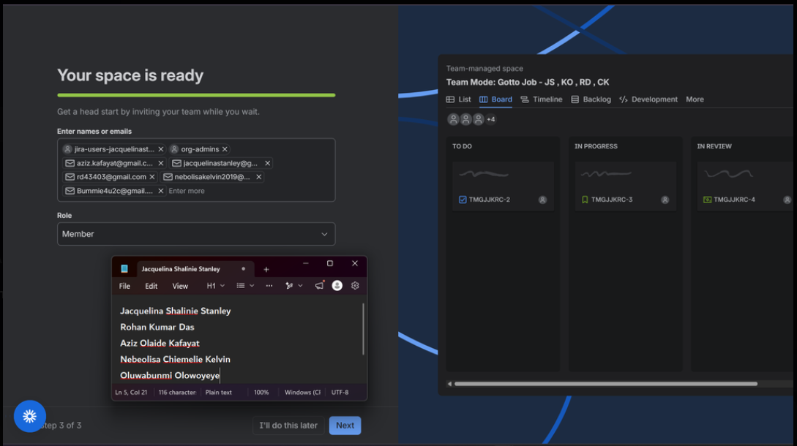

---

### Notes

Write one line for each role: PO (what you prioritized), SM (how you ensured process), Dev Lead (what you built), DevOps Lead (how you shipped).

We went with Team Mode for this one. I wanted the real experience of working inside a team, not just running solo through Jira. Here's how we split the roles:

| Role | What We Did | Team Member |
|------|-------------|-------------|
| Scrum Masters | Kept us inside the 90 minute time box, made sure we followed the Scrum process, wrote up the Sprint Goal, and kept the backlog and sprint visible to everyone | Jacquelina Shalinie Stanley, Rohan Kumar Das, Aziz Olaide Kafayat, Nebeolisa Chiemelie Kelvin, Oluwabunmi Olowoyeye |
| Product Owner | Prioritized the backlog based on what would actually matter to a user, how visible it was, how much it built trust, and how much effort it would take | Jacquelina Shalinie Stanley |
| Dev Lead 1 | Went through the Gotto Job codebase and shipped a UI only fix, no backend touched, for stories 7 and 8 | Aziz Olaide Kafayat |
| Dev Lead 2 | Went through the Gotto Job codebase and shipped a UI only fix for stories 1, 2 and 3 | Nebeolisa Chiemelie Kelvin |
| Dev Lead 3 | Went through the Gotto Job codebase and shipped a UI only fix for stories 4, 5 and 6 | Oluwabunmi Olowoyeye |
| DevOps Lead | Committed the change with Git, pushed it live, verified it worked, and documented the deployment | Rohan Kumar Das |

---

# Task 2 — Create the Jira Project (Team-managed → Scrum)

## Goal

Create a Team-managed Scrum project named `Gotto Job – Team <#>` (Team Mode) or `Gotto Job – <YourName>` (Solo Mode).

### Evidence

#### Screenshot 2 — Project created page showing the project name and key

We created a Team managed Scrum project and named it Gotto Job. Simple step, but it set the foundation for everything else.

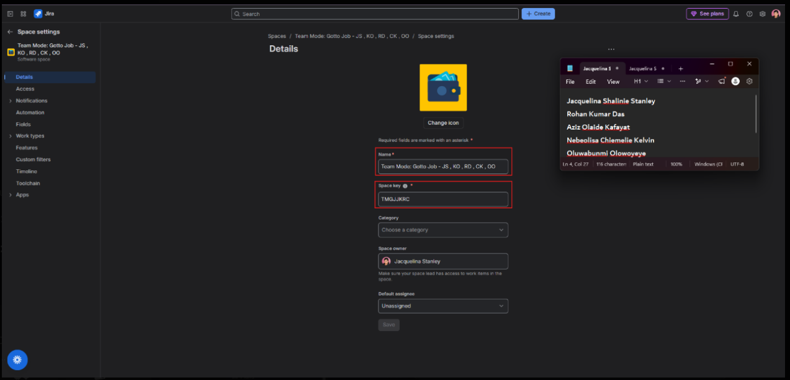

---

# Task 3 — Create the Epic

## Goal

Create the Epic `Improve Gotto Job UI discoverability & trust` to group the UI improvement initiative.

### Evidence

#### Screenshot 3 — Backlog showing the Epic panel with the Epic visible

We grouped our work under one Epic: Improve Gotto Job UI discoverability and trust. Everything we built after this rolled up under that one goal.

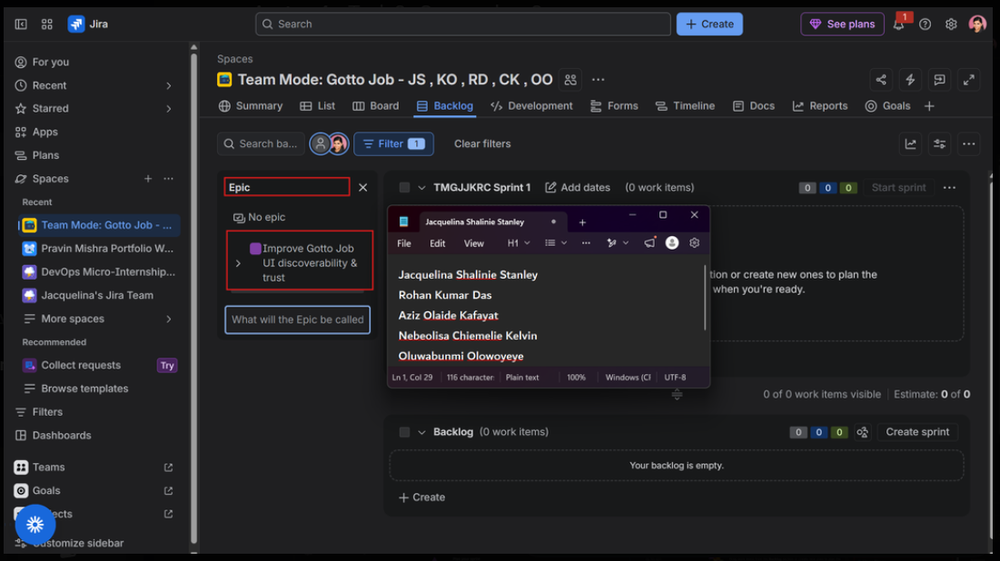

---

# Task 4 — Seed the Product Backlog (6–8 Stories + Fibonacci Points + Ranking)

## Goal

Create at least six Stories under the Epic, estimate each with 1, 2, or 3 story points, and rank them by value.

### Evidence

#### Screenshot 4 — Backlog showing the Epic and at least six Stories under it

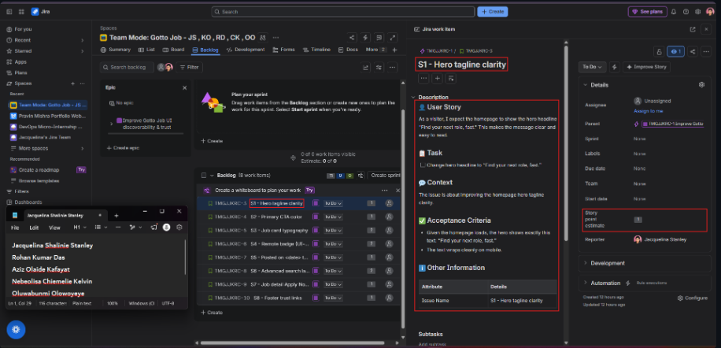

---

#### Screenshot 5 — One Story opened showing its Story Points and acceptance criteria filled in

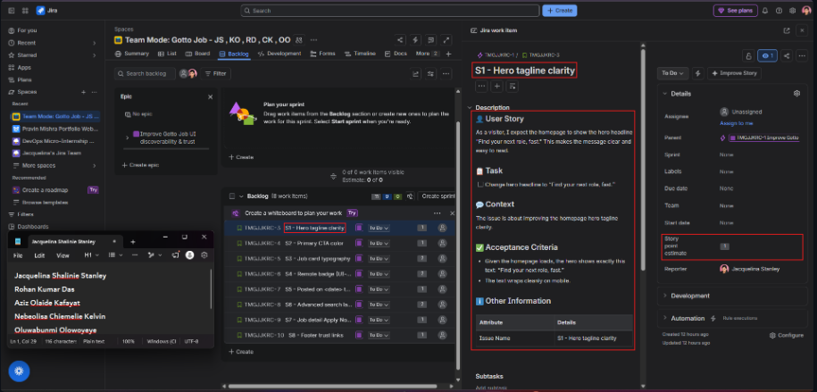

---

# Task 5 — Planning Poker (Estimate + Debate Notes)

## Goal

Confirm the Story Points (1, 2, or 3) for each Story and record brief reasoning for each estimate.

### Evidence

#### Screenshot 6 — Backlog showing Story Points visible, or two or three Stories opened showing their points

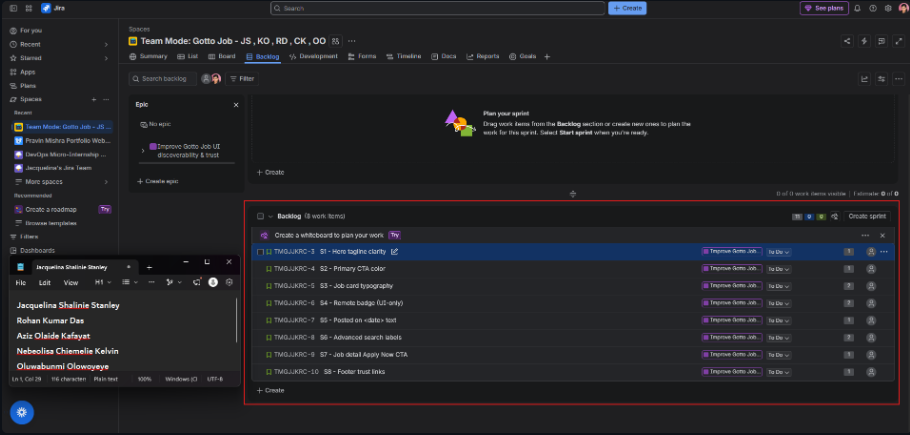

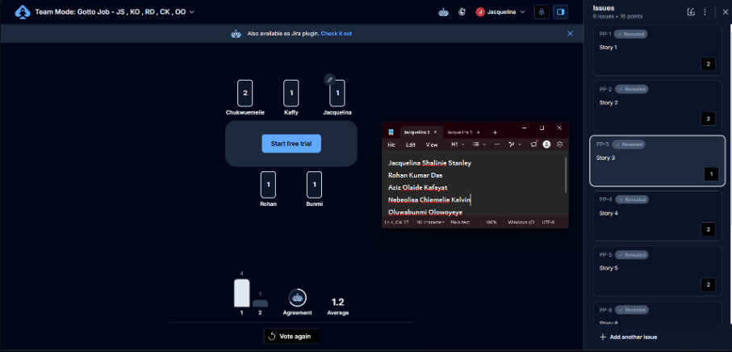

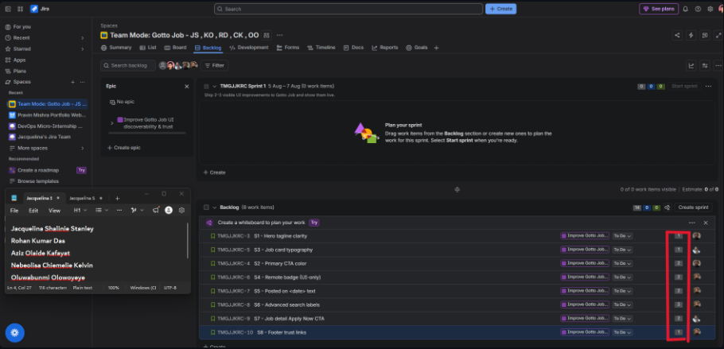

---

### Notes

For each story, explain in one or two lines why it is a 1, 2, or 3 (mention any debate, even in Solo Mode).

This is where it got interesting. We didn't just throw numbers at stories, we actually talked through them.

| Story | Final Estimate | Reason |
|-------|-----------------|--------|
| Story 1 | 2 | We landed on 2 because it needed a small feature plus real testing to confirm it worked. There was a quick back and forth on whether it was a 1 or 2, but the extra validation tipped it to 2. |
| Story 2 | 2 | Similar story here, moderate build plus testing. We debated 1 versus 2 and agreed the implementation work justified the 2. |
| Story 3 | 1 | This one was simple. Low complexity, quick to build, everyone agreed on 1 without much back and forth. |
| Story 4 | 2 | Touched a few components and needed verification after, so more than a quick fix but not a big lift either. |
| Story 5 | 2 | Build plus test, moderate effort, more than a one point task. |
| Story 6 | 3 | This was the biggest one. Build, deploy, and validate all in one story, plus the coordination it took made it the most complex thing we tackled. |
| Story 7 | 2 | Needed implementation plus confirming it actually worked post deployment. Minor discussion, moderate work. |
| Story 8 | 2 | Implementation plus final check before we called it done. More than a quick change, still manageable in the sprint. |

---

# Task 6 — Sprint Planning: Create Sprint 1 + Sprint Goal + Scope

## Goal

Create Sprint 1, move three or four Stories into it (approximately 3–6 points), set the Sprint Goal, and break each selected Story into Build, Verify, Deploy, and Screenshot Sub-tasks.

### Evidence

#### Screenshot 7 — Sprint 1 with the selected Stories inside it

We created Sprint 1, pulled in stories that added up to roughly 3 to 6 points, set our Sprint Goal, and broke each story into Build, Verify, Deploy, and Screenshot sub tasks so we all knew exactly what done looked like.

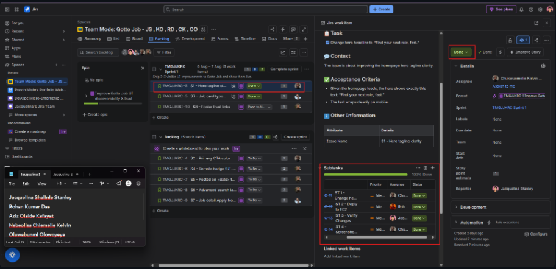

---

#### Screenshot 8 — One Story showing the Sub-tasks created

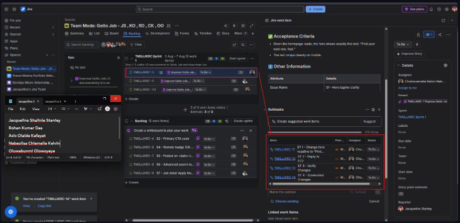

---

# Task 7 — Reports: Open Burndown Chart

## Goal

Open the Burndown Chart and confirm it exists for Sprint 1. It is acceptable if the chart is not yet populated.

### Evidence

#### Screenshot 9 — Burndown Chart page opened, even if empty

Opened it up and confirmed it existed for Sprint 1. Empty at this point, but the tracking was in place.

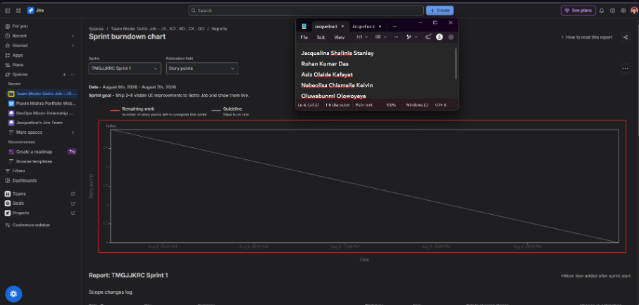

---

# Task 8 — Ship One Small Increment (Build + Deploy + Proof)

## Goal

Implement one small UI-only Story from Sprint 1, commit it, deploy it live, and move the Story and its Sub-tasks to Done in Jira.

### Evidence

#### Screenshot 10 — Jira board showing the Story moved to Done

This is the part I'm proud of. I fixed the typography on the job listings, cleaning up the hierarchy so the job title and key details actually stood out instead of blending together. Once it was ready, I opened a pull request and sent it to Rohan, who reviewed it and merged it into main. Watching something I touched go from a local change to a live deployed fix, through an actual PR review, was honestly the best part of this whole exercise.

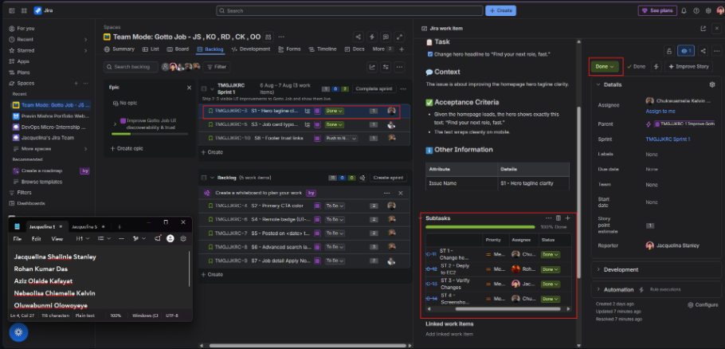

---

#### Screenshot 11 — Git commit output

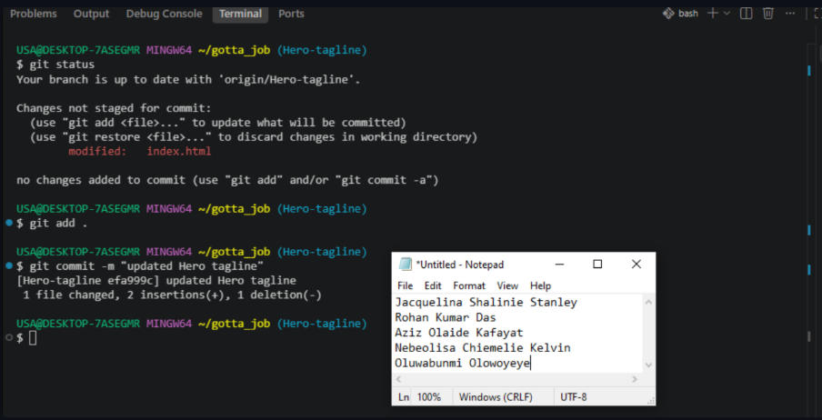

---

#### Screenshot 12 — Live URL in the browser showing the UI change, with the URL visible

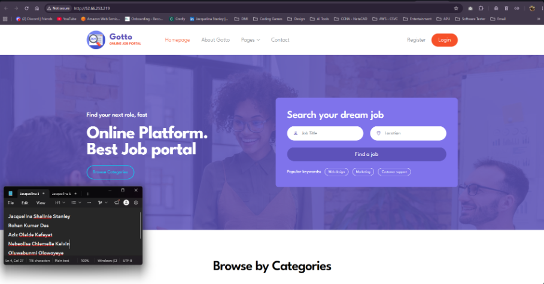

---

# Task 9 — Retro Notes (Scrum Pillar + Value)

## Goal

Add a retro comment covering what went well, what to improve, one Scrum pillar observed (Transparency, Inspection, or Adaptation), and one Scrum value (Openness, Focus, Commitment, Courage, or Respect).

### Evidence

#### Screenshot 13 — Jira retro comment visible

What went well: the team stayed engaged for the full session and everyone showed up ready to contribute.

What to improve: communication around who was doing what could have been tighter early on.

Scrum pillar observed: Transparency. The backlog and sprint board stayed visible to everyone the entire time, no surprises.

Scrum value: Commitment. Everyone stayed in it for the full 90 minutes, no one checked out halfway through.

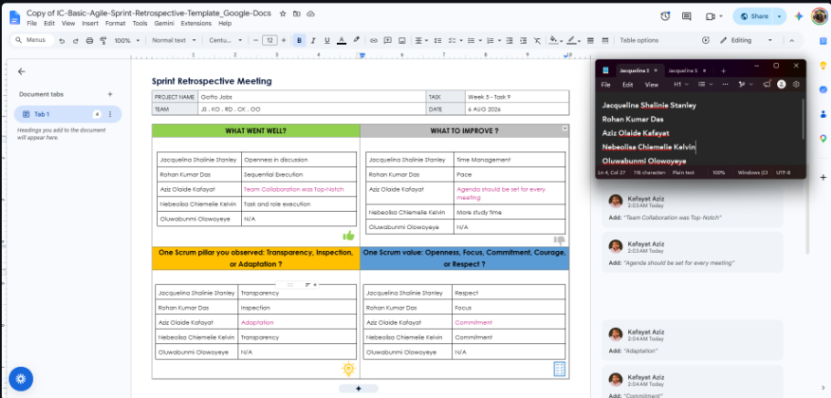

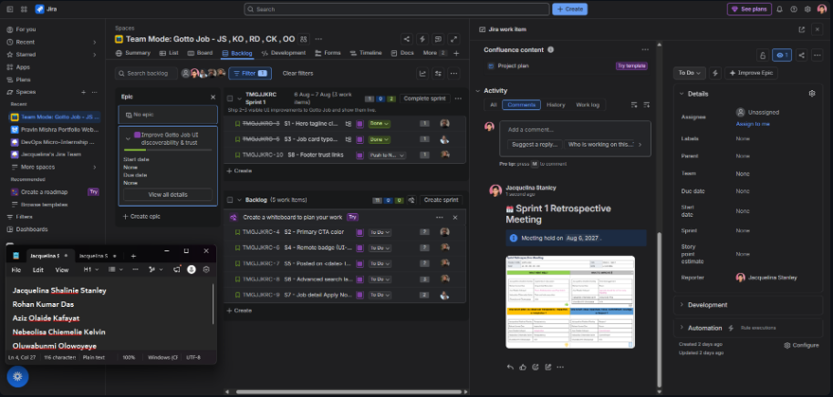

---

# Task 10 — LinkedIn Post (Mandatory)

## Goal

Publish a LinkedIn post about what you delivered, including your live URL, three to five lines on what you did and learned, and one screenshot (Burndown Chart, Sprint board, or the live UI change).

## Evidence

#### LinkedIn Post URL

Paste your LinkedIn post URL here:

`https://www.linkedin.com/posts/oluwabunmi-olowoyeye_dmiwithpravin-devops-agile-ugcPost-7494162687166341120-XkGb/?utm_source=share&utm_medium=member_desktop&rcm=ACoAABIxKt4BWOFz-d7RRyAsVUilmny_HuUV_Iw`

---

#### Screenshot 14 — Published LinkedIn post

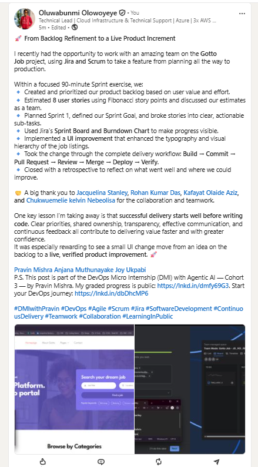

---

# Submission Instructions

- Add all 14 required screenshots
- Full name must be visible in required screenshots
- Do not expose sensitive information (keys, passwords, account IDs)

---

# Completion Checklist

- [ ] Task 1: Team Mode or Solo Mode selected and all four roles documented (Screenshot 1 & Notes)
- [ ] Task 2: Team-managed Scrum project created with the required name (Screenshot 2)
- [ ] Task 3: UI improvement Epic created (Screenshot 3)
- [ ] Task 4: 6–8 Stories added under the Epic and ranked by value (Screenshots 4 & 5)
- [ ] Task 5: Story Points set (1, 2, or 3) with reasoning recorded (Screenshot 6 & Notes)
- [ ] Task 6: Sprint 1 created with Sprint Goal, 3–4 Stories, and Sub-tasks (Screenshots 7 & 8)
- [ ] Task 7: Burndown Chart opened (Screenshot 9)
- [ ] Task 8: One UI-only increment implemented, committed, deployed, and verified (Screenshots 10–12)
- [ ] Task 9: Retro comment with one Scrum pillar and one Scrum value (Screenshot 13)
- [ ] Task 10: Mandatory LinkedIn post published with the live URL, backlog refinement, Sprint planning, one shipped increment, proof, and Screenshot 14
- [ ] Full Name visible in required screenshots
- [ ] No sensitive data exposed

---

## 📌 About DMI & CloudAdvisory

DevOps Micro Internship (DMI) is a project-based DevOps program run by Pravin Mishra (The CloudAdvisory) focused on real-world execution, systems thinking, and career readiness.

It helps learners build strong DevOps foundations with hands-on experience.

---

## 📌 Resources

- 🌐 DMI Official Website: https://dmi.pravinmishra.com?utm_source=github&utm_medium=readme  
- 🎓 University: https://university.pravinmishra.com?utm_source=github&utm_medium=readme  
- 💬 Discord Community: https://discord.pravinmishra.com?utm_source=github&utm_medium=readme  
- 📝 Blog: https://dmi.pravinmishra.com/blog?utm_source=github&utm_medium=readme  
- ▶️ YouTube Playlist: https://www.youtube.com/playlist?list=PLFeSNDtI4Cho  
- 🔗 Pravin Mishra (LinkedIn): https://www.linkedin.com/in/pravin-mishra-aws-trainer/  
- 🏢 CloudAdvisory (LinkedIn): https://www.linkedin.com/company/thecloudadvisory/

---

*This submission is part of DevOps Micro Internship (DMI) Cohort 3 — Agentic AI Track.*
