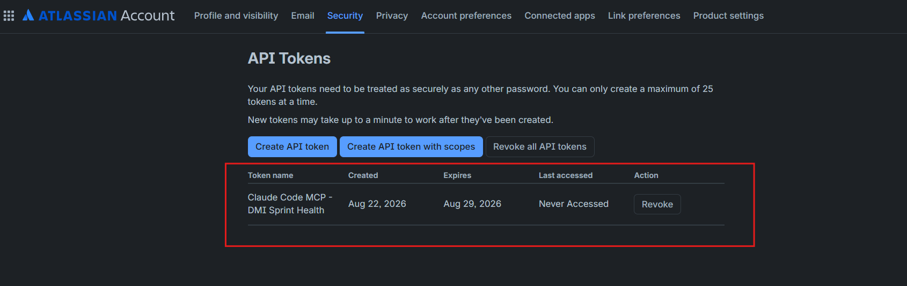
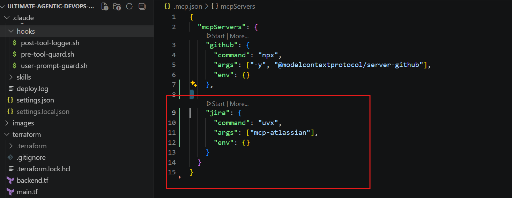
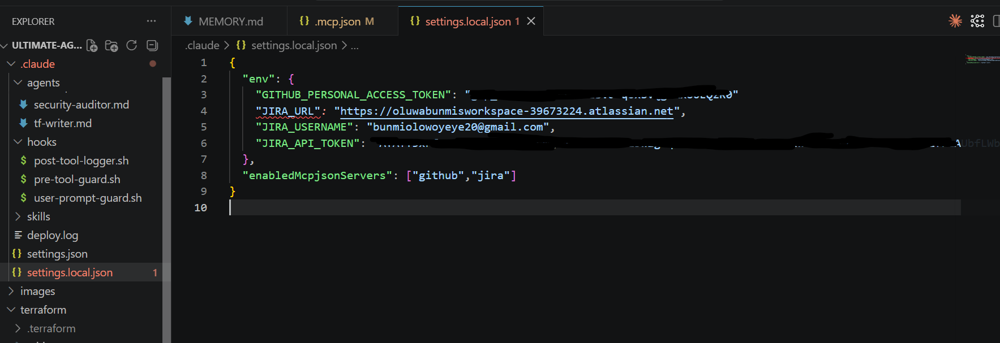
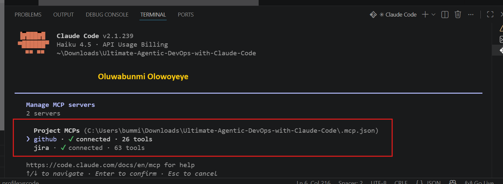
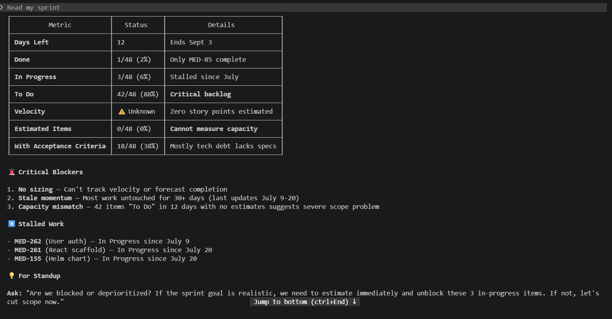
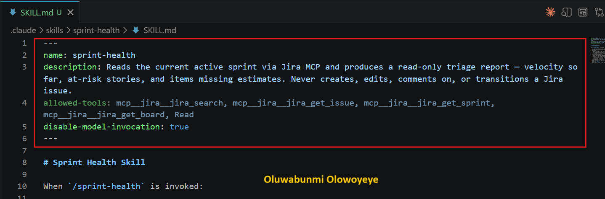
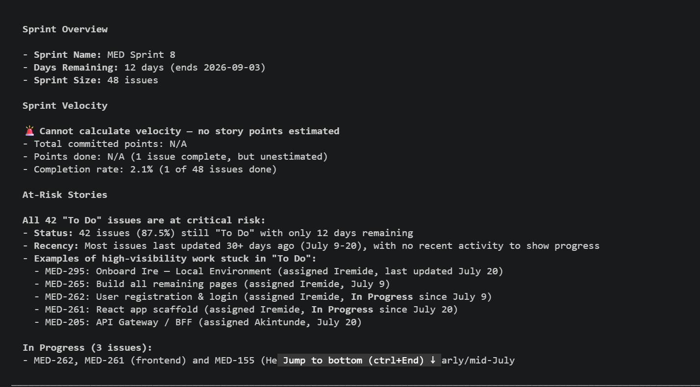
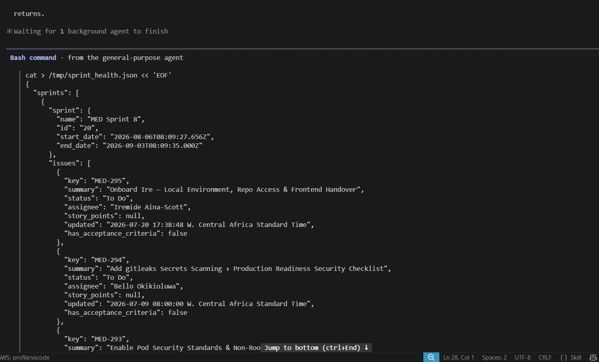

# Assignment 5 — AI-Assisted Sprint Health Report via Jira MCP

Part of the DevOps Micro Internship (DMI) Cohort 3 with Agentic AI

---

## Purpose

In this assignment, you will connect Claude Code to your Jira board through an MCP server, the same way you connected it to GitHub in Week 2, and build a read-only `/sprint-health` skill. The skill reads your current sprint through Jira's API and reports sprint velocity, stories at risk of missing the sprint, and items missing an estimate — but it must never create, edit, comment on, or transition a single ticket itself. You will prove that boundary holds by making a real change on the board yourself and confirming the skill only ever reports, never acts.

---

# Task 1 — Create a Jira API Token

## Goal

Generate an API token from your Atlassian account that the MCP server will use to authenticate with your Jira site. Do not screenshot the token value itself.

### Evidence

#### Screenshot 1 — Jira API token creation confirmation page showing the token name, with the token value not visible

### Notes You Must Write (Very Important):

Why does the MCP server need your site URL and account email in addition to the token?

The API token is used to authenticate my Jira account, but the token alone does not provide enough information for the MCP server to know where to connect or which Jira account the token belongs to.

The Jira site URL tells the MCP server which Jira instance to connect to, while the account email identifies the Jira user associated with the API token. The token then acts as the credential that proves I am authorized to access that account.

In simple terms, the three values work together: site URL = where to connect, account email = who I am, and API token = proof that I am authorized to access it.

---

# Task 2 — Create .mcp.json at the Project Root

## Goal

Create or update `.mcp.json` at your project root with a Jira MCP server block, following the same shape as the GitHub MCP server you configured in Week 2.

### Evidence

#### Screenshot 2 — `.mcp.json` open in VS Code showing the Jira server configuration

### Notes You Must Write (Very Important):

Compare this jira block to the github block from Week 2 Assignment 5. The GitHub server ran via npx (a Node.js package); this one runs via uvx (a Python package) — what stays exactly the same shape despite that difference, and why doesn't Claude Code care which language a given MCP server is written in?

The Jira and GitHub MCP server blocks follow the same basic MCP configuration structure even though they use different package runners. Both define an MCP server with a **command** and the required **arguments** needed to start that server.

The main difference is that the GitHub MCP server uses **npx**, which runs a Node.js package, while the Jira MCP server uses **uvx**, which runs a Python package. The surrounding MCP configuration remains the same because Claude Code does not need to understand the internal programming language of the server.

Claude Code only needs to know how to launch the MCP server and communicate with it using the standard **Model Context Protocol (MCP)**. As long as the server follows the MCP protocol, Claude Code can interact with it regardless of whether it was written in Python, JavaScript, TypeScript, or another supported language.

---

# Task 3 — Add Your Credentials to settings.local.json

## Goal

Add your Jira site URL, account email, and API token to `.claude/settings.local.json`, and confirm that file is listed in `.gitignore` so it is never committed.

### Evidence

#### Screenshot 3 — `settings.local.json` open in VS Code showing the `env` section, with the actual token value blurred or covered

### Notes You Must Write (Very Important):

Why must JIRA_API_TOKEN live in settings.local.json and never in .mcp.json?

The `JIRA_API_TOKEN` must be stored in `settings.local.json` because it is a sensitive credential and should never be included in a project configuration file that could be committed to source control.

The `.mcp.json` file defines **how the Jira MCP server is launched**, while `settings.local.json` provides the sensitive environment variables required at runtime. Keeping the token in the local settings file allows Claude Code to inject the credential when the MCP server starts without exposing it in the shared project configuration.

The `settings.local.json` file must also be included in `.gitignore` to prevent the token from accidentally being committed to Git. This separation follows good security practice by keeping configuration shareable while keeping secrets private.

---

# Task 4 — Verify the Connection with /mcp

## Goal

Restart Claude Code and confirm the Jira MCP server shows as connected.

### Evidence

#### Screenshot 4 — `/mcp` output showing `jira: connected`

---

# Task 5 — Run a Live Query to Prove Real Board Data

## Goal

Ask Claude to list the issues in your current active sprint through the Jira MCP connection, and confirm the result matches what you see on your live board in the browser.

### Evidence

#### Screenshot 5 — Claude's response showing the live sprint issue list retrieved via Jira MCP

### Notes You Must Write (Very Important):

How did you confirm this was real board data and not something Claude guessed?

I confirmed that the sprint information was real Jira board data by comparing Claude's response with the active sprint displayed on my Jira board in the browser.

I checked the issue keys, issue summaries, statuses, and other available details returned by the Jira MCP server against the corresponding tickets on the live Jira board. The information matched what was currently displayed in Jira.

This confirmed that Claude was retrieving the information through the connected Jira MCP server rather than generating or guessing the sprint data.

---

# Task 6 — Build the /sprint-health Skill

## Goal

Create a `/sprint-health` skill restricted to read-only Jira tools plus `Read`, with no issue-mutating tools and no `Write`. Run it and confirm it produces a report covering sprint velocity, at-risk stories, and items missing an estimate.

### Evidence

#### Screenshot 6 — `SKILL.md` frontmatter showing `allowed-tools` limited to read-only Jira tools plus `Read`, with `disable-model-invocation: true`

#### Screenshot 7 — `/sprint-health` output showing the full triage report against your real sprint

### Notes You Must Write (Very Important):

1. Which Jira MCP tools does this skill's allowed-tools list include, and which mutating tools (create issue, update issue, transition issue, add comment) does it deliberately exclude?

The `/sprint-health` skill is restricted to Jira tools that only retrieve information needed to analyze the sprint, together with the `Read` tool.

The allowed Jira tools are the **read-only/search tools** required to retrieve sprint information, issues, issue details, statuses, estimates, and related board data.

Deliberately excluded are all tools that can modify the Jira board, including:

* **Create issue**
* **Update issue**
* **Transition issue**
* **Add comment**

The skill also does not have access to `Write`, which prevents it from creating or modifying local files as part of its execution.

This ensures that `/sprint-health` can **Gather and Analyze** Jira data but cannot make changes to the board.

2. Why does a Scrum Master need this restriction more than almost any other role in this course?

A Scrum Master needs this restriction because the purpose of the sprint-health skill is to provide an objective view of the team's current sprint, not to make changes on behalf of the team.

If the skill had access to issue creation, updates, transitions, or comments, it could unintentionally change statuses, estimates, or other important sprint data while performing its analysis. This could compromise the accuracy and trustworthiness of the sprint report.

Keeping the skill read-only creates a clear separation between **analysis and action**. The skill can identify risks, missing estimates, and sprint trends, while the Scrum Master and team members remain responsible for deciding and making any changes to the board.

---

# Task 7 — Prove the Skill Never Mutates the Board

## Goal

Manually update one ticket on your board in the browser (for example, move a story to "Done" or add a missing estimate), then run `/sprint-health` again and confirm the new report reflects your change — proving the skill only ever reads live state and never wrote to the board itself.

### Evidence

#### Screenshot 8 — Second `/sprint-health` run showing the report now reflects your manual board change

### Notes You Must Write (Very Important):

Map this assignment to Gather → Analyze → Human Act → Verify from Week 3 Assignment 6. Which step did you perform manually in the browser, and why must that step stay human?

This assignment maps directly to the **Gather → Analyze → Human Act → Verify** workflow from Week 3 Assignment 6.

* **Gather:** The `/sprint-health` skill retrieved the current sprint information from Jira through the read-only MCP tools.
* **Analyze:** Claude analyzed the live data to identify sprint velocity, at-risk stories, and items missing estimates.
* **Human Act:** I manually changed the ticket in the Jira browser, such as moving the issue to a different status or adding the missing estimate.
* **Verify:** I ran `/sprint-health` again and confirmed that the new report reflected the change I had made manually.

The **Human Act** step must remain human because changes to the Jira board can affect team commitments, estimates, priorities, and sprint reporting. An AI assistant can provide analysis and recommendations, but the responsible team member should make the final decision and intentionally apply changes to the board.

This separation ensures that the automation remains useful while keeping important project-management decisions under human control.

---

# Submission Instructions

Complete all tasks in sequence.

Your submission must include:
- All 8 required screenshots
- All the required notes

---

# Completion Checklist

- [ ] Task 1: Jira API token created, value never screenshotted (Screenshot 1)
- [ ] Task 2: `.mcp.json` has the Jira server block (Screenshot 2)
- [ ] Task 3: Credentials stored in `settings.local.json`, token blurred, file gitignored (Screenshot 3)
- [ ] Task 4: `/mcp` shows the Jira server connected (Screenshot 4)
- [ ] Task 5: Live query returned real sprint data, verified against the browser (Screenshot 5)
- [ ] Task 6: `/sprint-health` skill created with correct read-only `allowed-tools`, and produced a full report (Screenshots 6–7)
- [ ] Task 7: A manual board change was reflected in a second `/sprint-health` run (Screenshot 8)
- [ ] Skill never created, edited, transitioned, or commented on any issue
- [ ] Reflection answered (Notes)
- [ ] No API token value exposed

---

## 📌 About DMI & CloudAdvisory

DevOps Micro Internship (DMI) is a project-based DevOps program run by Pravin Mishra (The CloudAdvisory) focused on real-world execution, systems thinking, and career readiness.

It helps learners build strong DevOps foundations with hands-on experience.

---

## 📌 Resources

- 🌐 DMI Official Website: https://dmi.pravinmishra.com?utm_source=github&utm_medium=readme  
- 🎓 University: https://university.pravinmishra.com?utm_source=github&utm_medium=readme  
- 💬 Discord Community: https://discord.pravinmishra.com?utm_source=github&utm_medium=readme  
- 📝 Blog: https://dmi.pravinmishra.com/blog?utm_source=github&utm_medium=readme  
- ▶️ YouTube Playlist: https://www.youtube.com/playlist?list=PLFeSNDtI4Cho  
- 🔗 Pravin Mishra (LinkedIn): https://www.linkedin.com/in/pravin-mishra-aws-trainer/  
- 🏢 CloudAdvisory (LinkedIn): https://www.linkedin.com/company/thecloudadvisory/

---

*This submission is part of DevOps Micro Internship (DMI) Cohort 3 — Agentic AI Track.*
